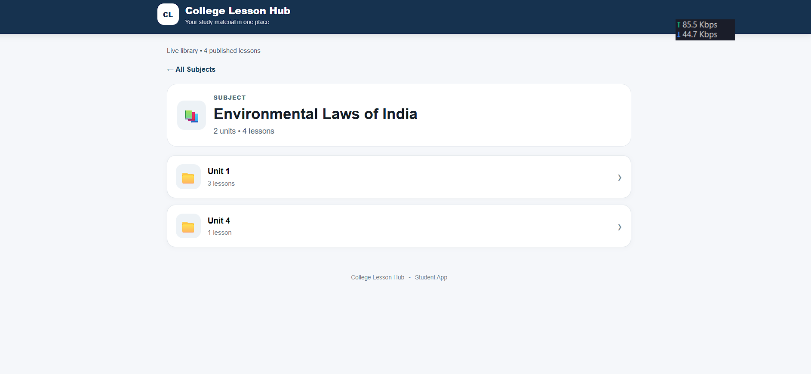
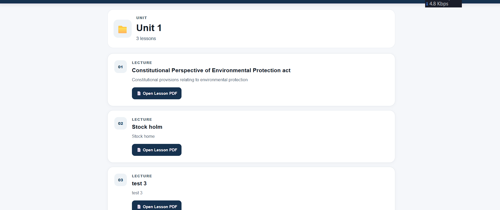
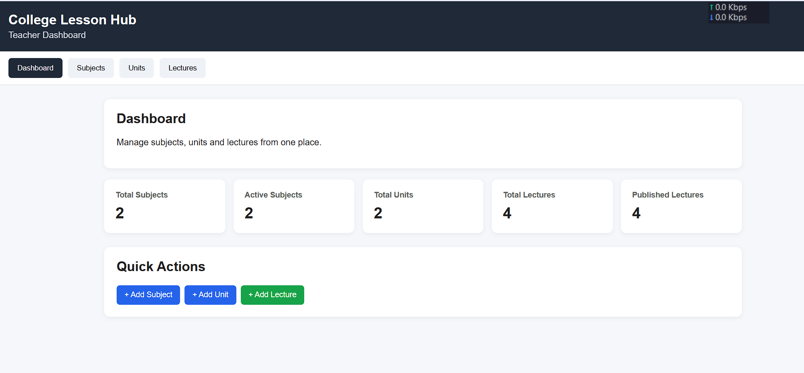
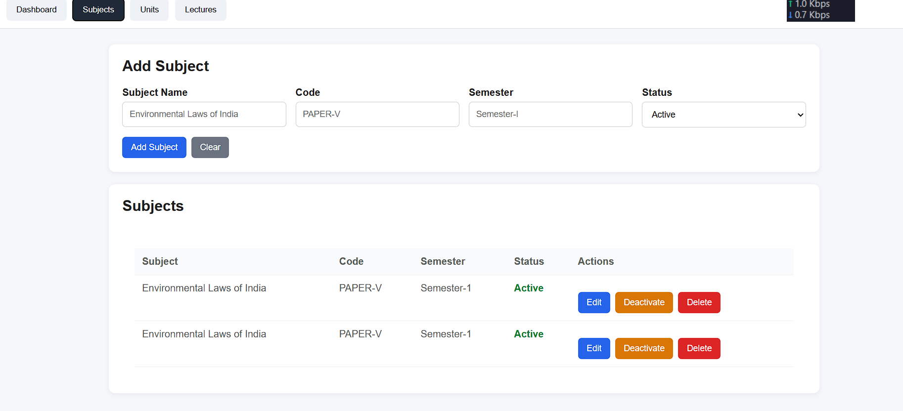
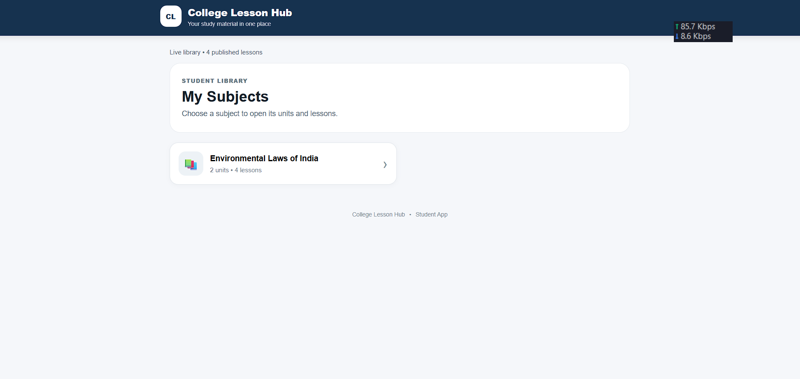

# 🎓 College Lesson Hub

> **A mobile-first Progressive Web App (PWA) for colleges to organize and distribute learning materials through a teacher-managed content system.**

[](https://developer.mozilla.org/en-US/docs/Web/Progressive_web_apps)
[](https://pages.github.com/)
[](https://developers.google.com/apps-script)
[](https://www.google.com/sheets/about/)

## 🚀 Live Student App

**[Open College Lesson Hub](https://verma26121994.github.io/collage-app/)**

The student application can be opened on a phone or computer and installed as a PWA where supported.

---

## 💡 Problem

College learning material is often distributed through scattered WhatsApp messages, PDFs, links, and manual communication.

This project was designed to provide a simple centralized experience where:

**Subject → Unit → Lecture → PDF**

Students can access published learning material from one application.

---

## 🛠️ Solution

College Lesson Hub separates the **student experience** from the **teacher content-management workflow**.

### 👨‍🎓 Student Side

- Mobile-first interface
- Installable PWA
- Subject → Unit → Lecture navigation
- Direct access to lecture PDFs
- Simple learning-focused interface
- New published lessons can appear without reinstalling the application

### 👨‍🏫 Teacher Side

- Private Teacher Dashboard
- Subject management
- Unit management
- Lecture management
- PDF upload
- Publish/unpublish workflow
- Dashboard statistics
- Teacher authorization
- Google Sheets-backed content management

---

## 🏗️ Architecture

```text
┌─────────────────────────┐
│    Teacher Dashboard    │
│    Google Apps Script   │
└────────────┬────────────┘
             │
             ▼
┌─────────────────────────┐
│      Google Sheets      │
│ Subjects / Units /      │
│ Lectures / Status       │
└────────────┬────────────┘
             │
       Published Content
             │
             ▼
┌─────────────────────────┐
│      Student PWA        │
│      GitHub Pages       │
└────────────┬────────────┘
             │
             ▼
┌─────────────────────────┐
│      Google Drive       │
│      Lecture PDFs       │
└─────────────────────────┘
## 📱 Student App Screenshots

### Home — Subject Library


### Subject View


### Lecture List


---

## 👨‍🏫 Teacher Dashboard

### Dashboard


### Subject Management

